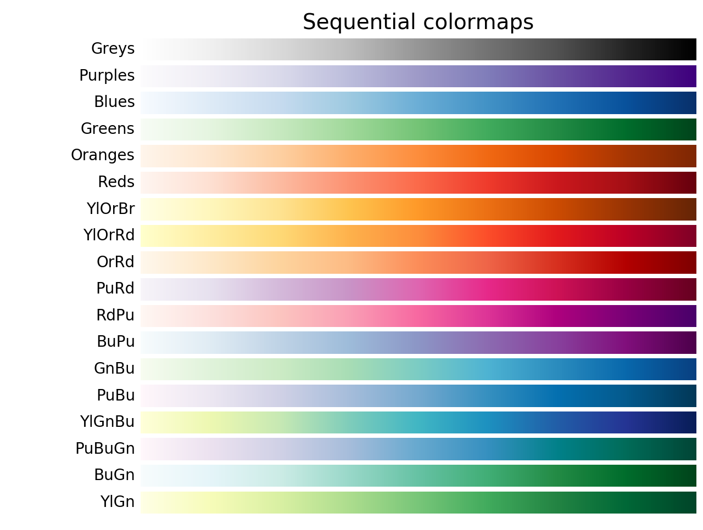
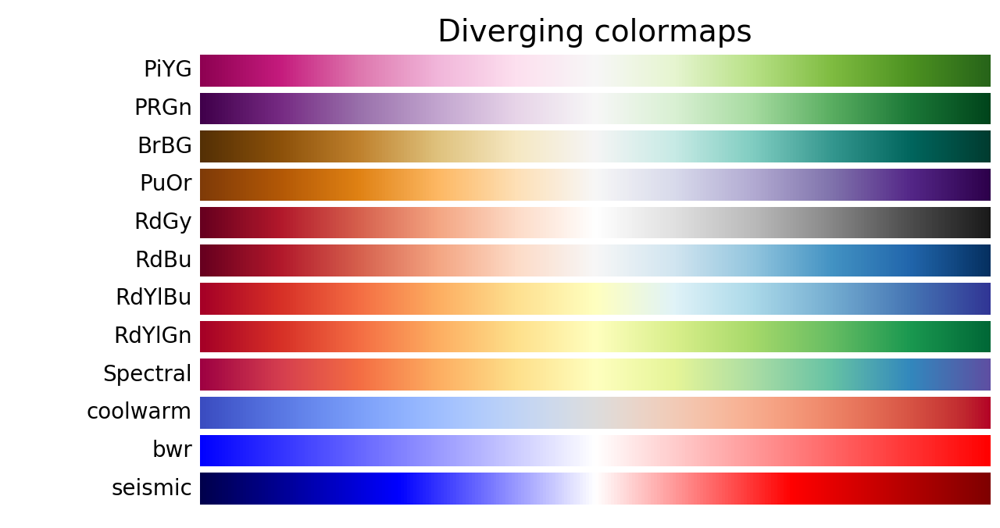
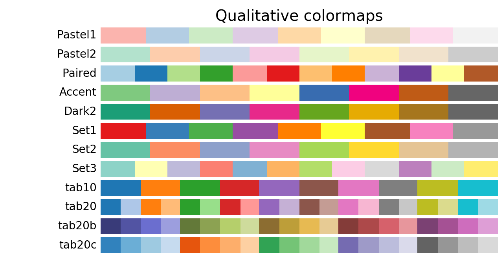
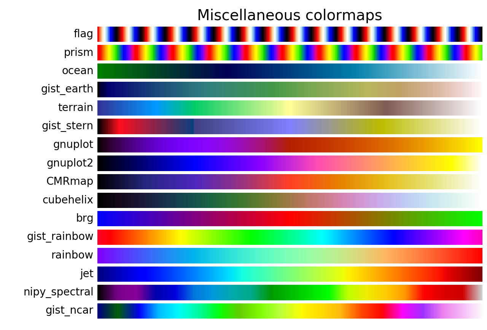

# Colormaps

Rio-tiler includes many colormaps, some derived from Matplotlib and some custom
ones that are commonly-used with raster data.

You can load a colormap with `rio_tiler.colormap.get_colormap`, and then pass it
to `rio_tiler.utils.render`:

```py
from rio_tiler.colormap import get_colormap
from rio_tiler.utils import render

colormap = get_colormap('cfastie')
render(tile, mask, colormap=colormap)
```



.png)





### Refs
- Matplotlib: https://matplotlib.org/3.1.0/tutorials/colors/colormaps.html
- cfastie: http://publiclab.org/notes/cfastie/08-26-2014/new-ndvi-colormap
- rplumbo: https://github.com/cogeotiff/rio-tiler/pull/90
- schwarzwald: http://soliton.vm.bytemark.co.uk/pub/cpt-city/wkp/schwarzwald/tn/wiki-schwarzwald-cont.png.index.html

### Update images for new colormaps

To regenerate these images for new colormaps, update the list of colormaps at
the top of `scripts/colormap_thumb.py` and then run

```bash
python scripts/colormap_thumb.py
```
